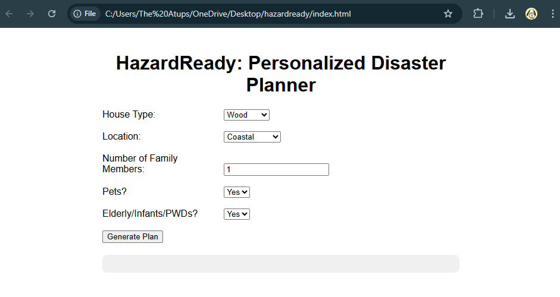

# HazardReady: Personalized Disaster Risk & Preparedness Planner

## Project Overview
HazardReady is a user-friendly application designed to assist families in **preparing for natural hazards**, such as typhoons, floods, and earthquakes. The program generates a **personalized emergency plan** based on the user’s house type, location, family members, pets, and other relevant factors. The goal is to provide **practical and actionable guidance** that is easy to follow, even for students and families with no technical background.

---

## Problem Statement
Existing disaster preparedness guides are often **too generic**, making it difficult for families to adapt advice to their specific circumstances. This can result in households being underprepared during emergencies. HazardReady addresses this issue by **creating customized checklists and emergency plans** tailored to each user’s unique situation.

---

## Project Objectives
The objectives of HazardReady are to:
1. Generate a **personalized emergency checklist** based on user inputs.  
2. Calculate a **risk score** for natural hazards (low, moderate, high).  
3. Provide a **family communication plan** and suggested evacuation strategies.  
4. Assess the **readiness of the family’s go-bag**.  
5. Offer **practical recommendations** to improve household safety.

---

## Planned Features
- Personalized emergency checklist  
- Risk scoring system for hazards  
- Family communication plan generator  
- Go-bag readiness assessment  
- Recommendations for improving safety at home

---

## Planned Inputs and Outputs

### Inputs:
- Type of house (wood, concrete, mixed)  
- Location (near river, coastal, urban, flood-prone, etc.)  
- Number of family members  
- Presence of pets  
- Presence of elderly, infants, or PWDs  
- Current go-bag items (yes/no)

### Outputs:
- Customized emergency checklist  
- Risk level (low, moderate, high)  
- Go-bag preparedness percentage  
- Printable family emergency contact sheet  
- Recommended evacuation strategy

---

## Logic Plan
1. **User Inputs**: Collected via text prompts or a simple web form.  
2. **Risk Evaluation**: The system calculates a risk score using IF-ELSE logic based on house type, location, and family factors.  
3. **Checklist Generation**: Recommended items, safety preparations, and family communication plan.  
4. **Go-Bag Health Assessment**: Compare user inputs against an ideal go-bag checklist.  
5. **Outputs**: Display risk score, customized checklist, go-bag readiness, and family plan.
*A flowchart and pseudocode will be included in the project documentation.*

---

## Website Screenshot

Here’s a screenshot of the HazardReady interactive website:

---

## Contributors
- Atup
- Cuevo
- Escala
